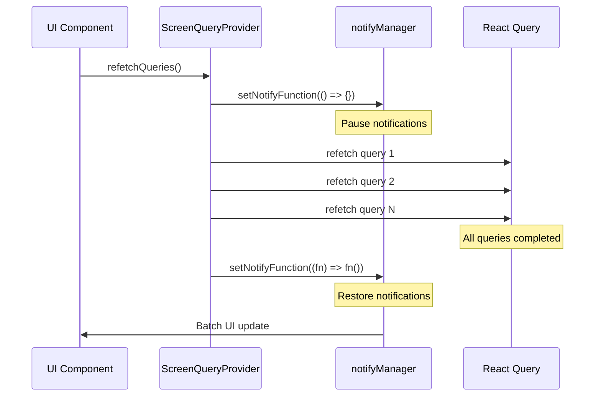

# System Architecture

## Overview

ScreenQueryProvider is a React Context system that integrates React Query (TanStack Query) with React Suspense/ErrorBoundary to synchronously manage multiple queries, preventing partial UI updates and screen flickering.

### Problems Solved

- **Prevention of partial UI updates**: Prevents screen flickering caused by multiple queries completing individually
- **Synchronized Pull-to-Refresh control**: Updates UI only once after all queries are completed
- **Natural integration with Suspense**: Throws query states as Promises that can be handled by Suspense
- **Centralized error handling**: Unified error handling through ErrorBoundary

## Overall Structure

```
┌─────────────────────────────────────────┐
│         ScreenQueryProvider             │
│  ┌───────────────────────────────────┐  │
│  │    ScreenQueryContext             │  │
│  │  - getQueryResult                 │  │
│  │  - refetchQueries                 │  │
│  │  - clearCache                     │  │
│  └───────────────────────────────────┘  │
│                                         │
│  Internal State Management:             │
│  - queriesRef (Map)                     │
│  - observersRef (Map)                   │
│  - queryPromiseRef (Map)                │
└─────────────────────────────────────────┘
                    │
    ┌───────────────┼───────────────┐
    ▼               ▼               ▼
useScreenQueryContext    useQueryKey
```

## Main Components

- **ScreenQueryProvider**: Context provider that manages all query states
- **ScreenQueryContext**: Context that child components access
- **useScreenQueryContext**: Hook to access the context
- **useQueryKey**: Helper hook that wraps useQuery and includes queryKey in return value

## ScreenQueryProvider Mechanism

### Internal State Management

```typescript
// Manages registered queries
const queriesRef = useRef<Map<string, ScreenQuery>>(new Map())

// Manages QueryObserver instances
const observersRef = useRef<Map<string, QueryObserver>>(new Map())

// Manages asynchronous Promise handling
const queryPromiseRef = useRef<Map<string, Promise<void>>>(new Map())
```

### Main Functions

#### 1. getQueryResult
Retrieves results for specified queries, throwing Promise during loading, Error on error, or returning data array on success.

```typescript
const getQueryResult = (results: readonly ScreenQueryResult[]) => {
  // Register or retrieve Observer
  // Check loading state
  // Throw Promise or Error, or return data
}
```

#### 2. refetchQueries
Refetches all registered queries. Controls notifications to achieve batch updates.

```typescript
const refetchQueries = async () => {
  // Temporarily disable notifications
  notifyManager.setNotifyFunction(() => {})

  try {
    // Refetch all queries in parallel
    await Promise.all(/* ... */)
  } finally {
    // Restore notifications (batch update occurs at this point)
    notifyManager.setNotifyFunction((fn) => fn())
  }
}
```

#### 3. clearCache
Clears cache for error state queries or all queries.

### Notification Control Mechanism



## Core Features

### Query Synchronization
- All queries within a ScreenQueryProvider are synchronized
- UI updates only occur when all queries are complete
- Prevents partial rendering states

### Error Boundary Integration
- Errors from any query are thrown to be caught by ErrorBoundary
- Centralized error handling across multiple queries
- Clean separation between loading, error, and success states

### Suspense Integration
- Loading states are thrown as Promises for Suspense to catch
- Natural integration with React's concurrent features
- Progressive loading with nested Suspense boundaries

## Performance Optimizations

### Map-based O(1) Access
Internal state uses Map for high-performance lookups with constant time complexity.

### Promise Deduplication
Identical query sets share the same Promise, reducing memory allocation and preventing duplicate network requests.

### Notification Batching
Controls React Query's notification system to batch UI updates, preventing partial updates and reducing render count.