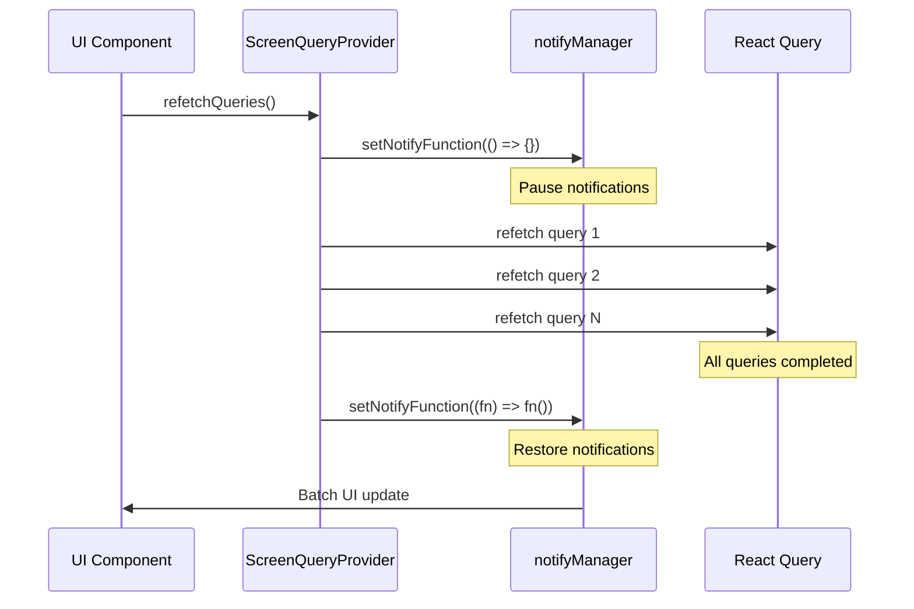

# System Architecture

## Overview

ScreenQueryProvider is a React Context system that integrates React Query (TanStack Query) with React Suspense/ErrorBoundary to synchronously manage multiple queries, preventing partial UI updates and screen flickering.

### Problems Solved

- **Prevention of partial UI updates**: Prevents screen flickering caused by multiple queries completing individually
- **Synchronized Pull-to-Refresh control**: Updates UI only once after all queries are completed
- **Natural integration with Suspense**: Throws query states as Promises that can be handled by Suspense
- **Centralized error handling**: Unified error handling through ErrorBoundary

## Overall Structure

```
┌─────────────────────────────────────────┐
│         ScreenQueryProvider             │
│  ┌───────────────────────────────────┐  │
│  │    ScreenQueryContext             │  │
│  │  - getQueryResult                 │  │
│  │  - refetchQueries                 │  │
│  │  - clearCache                     │  │
│  └───────────────────────────────────┘  │
│                                         │
│  Internal State Management:             │
│  - queriesRef (Map)                     │
│  - observersRef (Map)                   │
│  - queryPromiseRef (Map)                │
└─────────────────────────────────────────┘
                    │
    ┌───────────────┼───────────────┐
    ▼               ▼               ▼
useScreenQueryContext    useQueryKey
```

## Main Components

- **ScreenQueryProvider**: Context provider that manages all query states
- **ScreenQueryContext**: Context that child components access
- **useScreenQueryContext**: Hook to access the context
- **useQueryKey**: Helper hook that wraps useQuery and includes queryKey in return value

## ScreenQueryProvider Mechanism

### Internal State Management

```typescript
// Manages registered queries
const queriesRef = useRef<Map<string, ScreenQuery>>(new Map())

// Manages QueryObserver instances
const observersRef = useRef<Map<string, QueryObserver>>(new Map())

// Query keys already reported as detached, to keep the warning to one per key
const warnedRef = useRef<Set<string>>(new Set())

// Manages asynchronous Promise handling
const queryPromiseRef = useRef<Map<string, Promise<void>>>(new Map())
```

### Main Functions

#### 1. getQueryResult
Retrieves results for specified queries, throwing Promise during loading, Error on error, or returning data array on success.

```typescript
const getQueryResult = (
  results: readonly ScreenQueryResult[],
  options?: { suspendOnCreate?: boolean }
) => {
  // Register or retrieve Observer
  // Check loading state or suspendOnCreate option
  // Throw Promise or Error, or return data
}
```

**Options**:
- `suspendOnCreate` - If true, throws Promise when observer is first created (default: `false`)

#### 2. refetchQueries
Refetches all registered queries. Controls notifications to achieve batch updates.

```typescript
const refetchQueries = async () => {
  // Temporarily disable notifications
  notifyManager.setNotifyFunction(() => {})

  try {
    // Refetch all queries in parallel
    await Promise.all(/* ... */)
  } finally {
    // Restore notifications (batch update occurs at this point)
    notifyManager.setNotifyFunction((fn) => fn())
  }
}
```

#### 3. clearCache
Clears cache for error state queries or all queries.

### Where the Suspend Decision Comes From

`getQueryResult` suspends when any **registered** query is pending, and each
registered query reports its state from one of two sources (`readQueryStates`):

| Query | State read from |
| --- | --- |
| Passed in this call | The caller's own result |
| Registered by another call | Its provider-owned observer's snapshot |

A result the caller passed is recomputed from the live cache entry on every render,
and it is also what `getQueryResult` hands back. Deciding from it is what keeps the
decision and the returned data in step: a query cannot be treated as settled while
its `data` is still `undefined`, so the declared return type - data, never
`undefined` - holds. For the same reason the error thrown to the ErrorBoundary comes
from those results.

Observer snapshots cover the queries nobody passed this render, which is what keeps
components that resolve at different times from painting in parts. Reading their live
state instead would gate a screen on queries no live screen holds: a query the
previous screen left behind would have to be fetched again before the current screen
could paint.

The suspend promise then waits on exactly the queries that decision found pending
(`createObserverPromise`). Waiting on a query the decision considered settled would
resolve the promise at once and suspend again on the retried render, spinning
through renders until the query happens to settle on its own.

### Observer Lifecycle

Provider-owned observers live in `observersRef` until `clearCache` or provider
unmount destroys them, but they are only **subscribed** while a suspend promise is
waiting on them. That asymmetry is worth understanding, because an unsubscribed
observer neither keeps its query in the cache nor hears about it:

- An unsubscribed observer is not notified when the query it holds is rewound in
  place. `resetQueries()` keeps the same `Query` object and only puts its state back
  to pending, so nothing about the entry's identity changes and the snapshot stays at
  whatever the query looked like when it settled. This is why a snapshot cannot
  decide for a query the caller passed a result for.
- While a screen loads, the consumer's own observer (`useQuery` / `useQueryKey`) is
  not subscribed either - a suspended render never reaches its effects - so between
  the fetch settling and the retried render committing, the query can have **zero
  observers**. A `gcTime: 0` entry is garbage collected in that window, and the
  consumer rebuilds it as pending on its next render while the provider's observer
  still holds the collected one.

An observer holding a detached query is not just stale, it is inert: the suspend
promise waiting on it would subscribe to - and fetch - the query the cache has
thrown away, so nothing would fetch the entry the screen is reading and the screen
would never leave its fallback. So a reused observer is re-pointed at the query
currently in the cache (`syncObserverQuery`), which turns the situation into a normal
suspend-and-refetch. The same applies when the entry is replaced deliberately by
`removeQueries` / `queryClient.clear()`.

Recovering is not free: the query is fetched again, and a screen that had already
painted falls back to its loading state before painting a second time. Since that is
a real cost hiding behind a working screen, the recovery is reported once per query
key with `console.warn` outside production (`warnDetachedQuery`). The usual fix on
the consumer side is a `gcTime` larger than the gap between the fetch settling and
the render committing - a second is plenty, and the entry is still discarded when the
screen goes away.

### Notification Control Mechanism


```mermaid
sequenceDiagram
    participant UI as UI Component
    participant SP as ScreenQueryProvider
    participant NM as notifyManager
    participant RQ as React Query

    UI->>SP: refetchQueries()
    SP->>NM: setNotifyFunction(() => {})
    Note over NM: Pause notifications

    SP->>RQ: refetch query 1
    SP->>RQ: refetch query 2
    SP->>RQ: refetch query N

    Note over RQ: All queries completed

    SP->>NM: setNotifyFunction((fn) => fn())
    Note over NM: Restore notifications
    NM->>UI: Batch UI update
```

## Core Features

### Query Synchronization
- All queries within a ScreenQueryProvider are synchronized
- UI updates only occur when all queries are complete
- Prevents partial rendering states

### Error Boundary Integration
- Errors from any query are thrown to be caught by ErrorBoundary
- Centralized error handling across multiple queries
- Clean separation between loading, error, and success states

### Suspense Integration
- Loading states are thrown as Promises for Suspense to catch
- Natural integration with React's concurrent features
- Progressive loading with nested Suspense boundaries

## Performance Optimizations

### Map-based O(1) Access
Internal state uses Map for high-performance lookups with constant time complexity.

### Promise Deduplication
Identical query sets share the same Promise, reducing memory allocation and preventing duplicate network requests.

### Notification Batching
Controls React Query's notification system to batch UI updates, preventing partial updates and reducing render count.