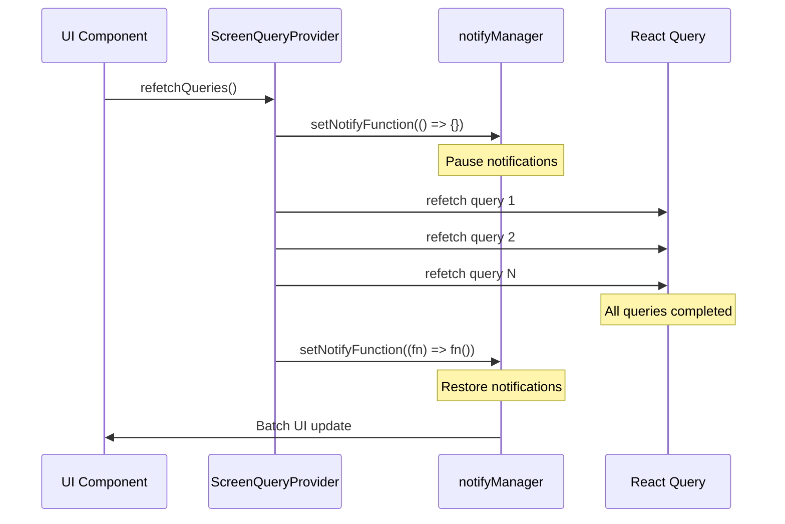

# System Architecture

## Overview

ScreenQueryProvider is a React Context system that integrates React Query (TanStack Query) with React Suspense/ErrorBoundary to synchronously manage multiple queries, preventing partial UI updates and screen flickering.

### Problems Solved

- **Prevention of partial UI updates**: Prevents screen flickering caused by multiple queries completing individually
- **Synchronized Pull-to-Refresh control**: Updates UI only once after all queries are completed
- **Natural integration with Suspense**: Throws query states as Promises that can be handled by Suspense
- **Centralized error handling**: Unified error handling through ErrorBoundary

## Overall Structure

```
┌─────────────────────────────────────────┐
│         ScreenQueryProvider             │
│  ┌───────────────────────────────────┐  │
│  │    ScreenQueryContext             │  │
│  │  - getQueryResult                 │  │
│  │  - refetchQueries                 │  │
│  │  - clearCache                     │  │
│  └───────────────────────────────────┘  │
│                                         │
│  Internal State Management:             │
│  - queriesRef (Map)                     │
│  - observersRef (Map)                   │
│  - queryPromiseRef (Map)                │
└─────────────────────────────────────────┘
                    │
    ┌───────────────┼───────────────┐
    ▼               ▼               ▼
useScreenQueryContext    useQueryKey
```

## Main Components

- **ScreenQueryProvider**: Context provider that manages all query states
- **ScreenQueryContext**: Context that child components access
- **useScreenQueryContext**: Hook to access the context
- **useQueryKey**: Helper hook that wraps useQuery and includes queryKey in return value
- **useSyncQuery**: Hook that reads query results through `getQueryResult`, passing the `QueryErrorResetBoundary` the component renders under

## ScreenQueryProvider Mechanism

### Internal State Management

```typescript
// Manages registered queries
const queriesRef = useRef<Map<string, ScreenQuery>>(new Map())

// Manages QueryObserver instances
const observersRef = useRef<Map<string, QueryObserver>>(new Map())

// Query keys already reported as detached, to keep the warning to one per key
const warnedRef = useRef<Set<string>>(new Set())

// Manages asynchronous Promise handling
const queryPromiseRef = useRef<Map<string, Promise<void>>>(new Map())

// Whether the result last passed for each query read as pending, and who registered it
const registrationsRef = useRef<Map<string, Registration>>(new Map())

// Queries components on screen hold (`retainQueries`), with how many hold each
const holdersRef = useRef<Map<string, { query: ScreenQuery; count: number }>>(new Map())
```

### Main Functions

#### 1. getQueryResult
Retrieves results for specified queries, throwing Promise during loading, Error on error, or returning data array on success.

```typescript
const getQueryResult = (
  results: readonly ScreenQueryResult[],
  options?: {
    suspendOnCreate?: boolean
    errorResetBoundary?: ErrorResetBoundary
    mounted?: boolean
  }
) => {
  // Register or retrieve Observer
  // Check loading state or suspendOnCreate option
  // Throw Promise or Error, or return data
}
```

**Options**:
- `suspendOnCreate` - If true, throws Promise when observer is first created (default: `false`)
- `errorResetBoundary` - The `QueryErrorResetBoundary` the caller renders under
- `mounted` - Whether the caller is already on screen (default: `false`). `useSyncQuery` passes it

#### 2. refetchQueries
Refetches all registered queries. Controls notifications to achieve batch updates.

```typescript
const refetchQueries = async () => {
  // Temporarily disable notifications
  notifyManager.setNotifyFunction(() => {})

  try {
    // Refetch all queries in parallel
    await Promise.all(/* ... */)
  } finally {
    // Restore notifications (batch update occurs at this point)
    notifyManager.setNotifyFunction((fn) => fn())
  }
}
```

#### 3. clearCache
Clears cache for error state queries or all queries.

#### 4. retainQueries
Holds queries in the registration while a component on screen reads them, and returns
the function that releases them. `useSyncQuery` holds the queries it reads from an
effect, so a query stays registered from the render that first passes it until the
last component reading it moves to another key or unmounts. See
[Registration Lifetime](#registration-lifetime).

### Where the Suspend Decision Comes From

`getQueryResult` suspends when any **registered** query is pending, and each
registered query reports its state from one of two sources (`readQueryStates`):

| Query | State read from |
| --- | --- |
| Passed in this call | The caller's own result |
| Registered by another call | Its provider-owned observer's snapshot |

A result the caller passed is recomputed from the live cache entry on every render,
and it is also what `getQueryResult` hands back. Deciding from it is what keeps the
decision and the returned data in step: a query cannot be treated as settled while
its `data` is still `undefined`, so the declared return type - data, never
`undefined` - holds. For the same reason the error thrown to the ErrorBoundary comes
from those results.

One passed result is not taken at its word: a result that reads as pending while its
cache entry has already settled with an error (`readSettledFailures`). A render retried
after a suspend mounts the consumer's observer afresh, and a fresh observer reports a
query that failed without data as pending, because it would fetch it on mount
(`retryOnMount`). The consumer never makes that fetch - the render is suspended and
never commits - so trusting the result would have the suspend promise fetch it through
the provider's observer instead, on every retried render, and a query that keeps
failing would never reach the ErrorBoundary. The cache entry is what tells the two
apart: fetching a query without data puts it back to pending, as do `clearCache` and
`resetQueries()`, so an `error` status means nothing has asked for it again. Such a
query counts as settled, and the error it settled with is thrown.

Retrying it takes an explicit request: `clearCache`, or a reset `QueryErrorResetBoundary`
passed as `errorResetBoundary`. While it is reset, failed queries are fetched instead of
thrown, as TanStack Query's suspense hooks do. The reset holds until a query read under
it commits, and a retried render never commits, so a retry that fails again clears it
from the suspend promise (`createObserverPromise`) - otherwise every retried render
would fetch the query once more.

Observer snapshots cover the queries nobody passed this render, which is what keeps
components that resolve at different times from painting in parts. Reading their live
state instead would gate a screen on queries no live screen holds: a query the
previous screen left behind would have to be fetched again before the current screen
could paint.

Which of those queries a caller waits for depends on whether it is on screen yet:

| Caller | Waits for the queries it did not pass | Why |
| --- | --- | --- |
| Already on screen (`mounted` is true) | None | A component already painted that waited for others would take down what it painted. A query registered by its own deferred render (`useDeferredValue`, a transition) would put the screen it is meant to keep back to its fallback |
| Still coming on screen | The ones other mounting renders registered | Components that paint together are the ones mounting together. The queries painted components hold, or register while they update (a transition, a refetch), are theirs to wait for |

And a query counts as pending only while the result last passed for it read as
pending too. A caller that got a result it could paint - placeholder data
(`placeholderData: keepPreviousData`) while the query itself is pending - has painted
it, so the query holds nobody back. Its observer, created while the query was
pending and subscribed by no promise, would report it as pending for good.

These only narrow the decision: a query the snapshot reports as settled is never
waited for. So how a component keeps its previous data while a key changes -
`useDeferredValue`, `startTransition` or `keepPreviousData` - does not change what
it or anyone else waits for; a plain state change suspends on its own new key, as a
suspense query would.

The suspend promise then waits on exactly the queries that decision found pending
(`createObserverPromise`). Waiting on a query the decision considered settled would
resolve the promise at once and suspend again on the retried render, spinning
through renders until the query happens to settle on its own.

### Registration Lifetime

A query stays registered while a component on screen holds it (`retainQueries`), and
`refetchQueries` fetches only those, plus the ones a call without `mounted` (a direct
`getQueryResult` call) registered. A hold keeps its own query key, because a sweep can
run between a component's render and its effect - in the gap between two time slices
of a concurrent render - and drop the registration of a query it is about to hold. A query that only a render still coming on
screen - or one React discarded - registered is not on screen, so it is not
refetched.

Queries leave the registration once a release has settled (a microtask: StrictMode,
and a key that moves from one component to another, release and hold it again within
the same commit). A query nothing holds and no direct call registered is dropped
when:

- its last holder released it (the component moved to another key or unmounted),
- a caller already on screen last registered it - a deferred render, discarded or
  still resolving, that nobody else waits for, or
- it has settled - nobody waits for a settled query.

A render still resolving a dropped query registers it again when it retries.

**A pending query a discarded mounting render registered stays until it settles**,
and components mounting in the meantime wait for it: nothing tells a discarded render
from one still resolving, and the mounting components alongside the latter must wait
for it. Switching a keyed boundary while its first load is in flight therefore makes
the new content wait for the old request whenever that request is the slower one
(an old request of 150ms and a new one of 30ms, switched at 36ms: the new content
resolves at 157ms instead of 66ms). A `ScreenQueryProvider` inside the keyed boundary
scopes the registration to the key, so the old request goes with it.

The observer of a dropped query is not destroyed, because a suspend promise may
still be subscribed to it; it detaches from the query once the query settles. A
dropped query still counts as observed for `suspendOnCreate`, so a component
returning to a cached key does not suspend again; only `clearCache` resets that.

### Observer Lifecycle

Provider-owned observers live in `observersRef` until their query is released, or
`clearCache` or provider unmount destroys them, but they are only **subscribed**
while a suspend promise is waiting on them. That asymmetry is worth understanding, because an unsubscribed
observer neither keeps its query in the cache nor hears about it:

- An unsubscribed observer is not notified when the query it holds is rewound in
  place. `resetQueries()` keeps the same `Query` object and only puts its state back
  to pending, so nothing about the entry's identity changes and the snapshot stays at
  whatever the query looked like when it settled. This is why a snapshot cannot
  decide for a query the caller passed a result for.
- While a screen loads, the consumer's own observer (`useQuery` / `useQueryKey`) is
  not subscribed either - a suspended render never reaches its effects - so between
  the fetch settling and the retried render committing, the query can have **zero
  observers**. A `gcTime: 0` entry is garbage collected in that window, and the
  consumer rebuilds it as pending on its next render while the provider's observer
  still holds the collected one. For `useSyncQuery` the window is closed: while a
  query it reads is pending, the provider keeps a second subscription on its observer
  (a bridge) until the component holds the query (`retainQueries`), which happens
  after the consumer's own observer has subscribed in the same commit. A query that
  fails drops its bridge at once - it is thrown to the ErrorBoundary rather than
  committed, and its retry has to be fetched by the suspend promise subscribing
  afresh. A caller bridges only the queries it passed, since only it holds them. A
  direct `getQueryResult` call holds nothing, so it bridges nothing and the window
  stays open for it. A bridge on a render React discarded lasts until its query
  leaves the registration - after the next release on screen - or the provider
  unmounts; until then its query stays observed.

An observer holding a detached query is not just stale, it is inert: the suspend
promise waiting on it would subscribe to - and fetch - the query the cache has
thrown away, so nothing would fetch the entry the screen is reading and the screen
would never leave its fallback. So a reused observer is re-pointed at the query
currently in the cache (`syncObserverQuery`), which turns the situation into a normal
suspend-and-refetch. The same applies when the entry is replaced deliberately by
`removeQueries` / `queryClient.clear()`.

Recovering is not free: the query is fetched again, and a screen that had already
painted falls back to its loading state before painting a second time. Since that is
a real cost hiding behind a working screen, the recovery is reported once per query
key with `console.warn` outside production (`warnDetachedQuery`). The usual fix on
the consumer side is a `gcTime` larger than the gap between the fetch settling and
the render committing - a second is plenty, and the entry is still discarded when the
screen goes away.

### Notification Control Mechanism


```mermaid
sequenceDiagram
    participant UI as UI Component
    participant SP as ScreenQueryProvider
    participant NM as notifyManager
    participant RQ as React Query

    UI->>SP: refetchQueries()
    SP->>NM: setNotifyFunction(() => {})
    Note over NM: Pause notifications

    SP->>RQ: refetch query 1
    SP->>RQ: refetch query 2
    SP->>RQ: refetch query N

    Note over RQ: All queries completed

    SP->>NM: setNotifyFunction((fn) => fn())
    Note over NM: Restore notifications
    NM->>UI: Batch UI update
```

## Core Features

### Query Synchronization
- All queries within a ScreenQueryProvider are synchronized
- UI updates only occur when all queries are complete
- Prevents partial rendering states

### Error Boundary Integration
- Errors from any query are thrown to be caught by ErrorBoundary
- Centralized error handling across multiple queries
- Clean separation between loading, error, and success states

### Suspense Integration
- Loading states are thrown as Promises for Suspense to catch
- Natural integration with React's concurrent features
- Progressive loading with nested Suspense boundaries

## Performance Optimizations

### Map-based O(1) Access
Internal state uses Map for high-performance lookups with constant time complexity.

### Promise Deduplication
Callers waiting for the same set of queries share the same Promise, reducing memory allocation and preventing duplicate network requests. The set is what a caller waits for, not what it passed: a mounting caller also waits for its peers.

### Notification Batching
Controls React Query's notification system to batch UI updates, preventing partial updates and reducing render count.